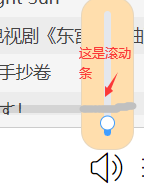

# xchsgmusic

## 关于点开我的网页，我想请求的事情：

**请一定要登录！！！！！！！！，我服务器获得的游客cookie因为我的调试已经被安全检测了，然后打开网页因为游客的身份也有区别所以没法解封，所以很多接口都会失效，所以请一定要登陆，为了你的体验**

## Project setup
```
npm install
```

### Compiles and hot-reloads for development
```
npm run serve
```

### Compiles and minifies for production
```
npm run build
```

### Lints and fixes files
```
npm run lint
```

### Customize configuration
See [Configuration Reference](https://cli.vuejs.org/config/).


## 在开发项目中我觉得受益匪浅的一些技巧

（欢迎指正，我也不清楚对不对，如果有改良的地方，希望不吝赐教，这是我的第一个项目，缺点应该会很多）

### 1.computed 不要在其中引用高频修改的属性值

这个是我在封装我的底部播放器时获取当前播放时长，当时会出现间断性的错误比如下一秒应该是1：33 结果又跳回了1：27 还持续显示1：27了3s，

获取当前事件的流程是：

1-1.audio触发timeupdate时使用getDuration函数，这里timeupdate平均一秒触发三次。

1-2 获取audio的currentTime属性进行加工，然后播放器中时长属性即可，

我原来是直接在audio里面直接@timeupdate = 修改data中的currentTime（未加工的时间），然后computed里面声明nowTime直接return加工完的时间，之后就出现了上述情况。后来排查原因后我直接在函数里面完成加工,nowTime也不设置为计算属性，然后这个问题就消失了。

其中我认为主要原因是**触发频率**问题。其中我设置节流定时器，限制timeupdate触发频率，然后出现数据错乱的时间点明显推迟，甚至2s一次直接没有这个问题了。但是计时这种秒级的肯定不能这样搞，

最后全排查了一遍，发现获取的原生数据没问题，然后只有加工后才出问题，这时候我又反思是不是因为我的加工逻辑写的太垃圾了导致性能不够？然后我把加工的过程省略，然后好了（又好像没好，忘记了太久以前敲的了），之后就是我说的方法，就ok了。

### 2. z-index要设置好，不然后期乱的不行

这个项目前期还好，后期包括隐藏左侧边框按钮，底部的音量按钮，搜索框，右侧边框等都用到了z-index排序，还有element-ui里面各种像loading，messagebox的幕布等，稍有不慎就会出现黑色的幕布把所有都遮住了，但是唯独没有遮住一个小按钮。

所以z-index的大小一定要有清晰的思路，而且**子级的z-index依赖于上一级定位的z-index，不是子级z-index越大就一定会在前面。所以不仅要考虑目标的z-index，还要考虑父级的z-index**。

**这里点名批评vue-scroll，这组件我再也不要用了，太折磨了，文档少的可怜，网上都是基本的教程，**

而且他的布局给我后期获取元素scrollTop等属性来置顶和适应性大小添加了不少麻烦，我下次项目一定自己写个scroll组件。

也是因为他的多层父子结构以及多层定位，我对着调试器看了一下午。它会造成如下情况



然后导致你在滑动音量的时候摸到滚动条，然后鼠标定位左上角直接音量100。

### 3.数据加载问题

这个是本项目最需要注意的点，起初因为我没有想出好的解决方案，开发过程中深受困扰。但其实本质很简单，也就我这么笨了（悲）。

**每个组件在created阶段需要用ajax获取接口的数据，但是由于axios请求都是异步的，那么就会导致created同步任务执行完了，接着去渲染模板了，这时候你请求的数据还没拿到，模板懵了，我数据呢？？？？。**

**正确的做法是设定isload 等待数据都加载完成了，在开始渲染你需要的模板，这样可以避免这个问题了**

```html
<template v-if="isload">
  你要渲染的内容
  <tempalte/>
```

下面是我的笨蛋方案大家不要学习，看个乐呵，如果有这个想法请立刻遏止。

法一：我设置一个定时器，等1s过后再重新渲染。但试了一会立刻驳回了。

请求数据的时间不会相同，请求大量数据需要1s甚至更多，但是一些小数据60ms就可以完成。速度慢的不能保证开始渲染模板前能拿到数据，速度快的又占用加载时间。

法二：把created设置为异步函数，await 其中包含请求的函数，等待数据都拿到了就可以继续了。

这个其实雀氏可行，但是后续加载提示等模板也不能渲染，用户不能看到加载提示，看着空白的一片还以为卡了，体验不好。其次给生命周期钩子声明成异步太怪了，本能抵触，**不知大家有没有更好的反驳理由**

### 4.点击非box区域box自动关闭

这个用于搜索框和侧边框

```js
window.addEventListener('click', (e) => {
  if (!this.$refs.footer.contains(e.target)) {
    // 如果点击的区域内不包含目标则将目标隐藏
    this.showList = false
  }
})
```

### 5.声明监听器后记得在组件beforeDestory的函数中remove

你听说了吗，调试栏中有奇怪的错误在游荡。因为他们的组件都销毁了，都没目标了肯定报错。

### 6.组件一定要细分，越细越好

**当一个功能被使用两次的时候，立刻马上把他声明称函数**，组件这种东西更夸张，有些组件可以被用好多次。这里自我反省，你可以看到我的songList组件，特别臃肿，一托答辩，

当时开发初期没想那么多，歌单面板就是SongListPanel 下面使用songList组件，后来写songList的时候虽然功能复杂，但是也还好。

后来遇到了数据类型不一样的专辑面板，每一行的展示的内容和歌单面板完全不一致，就要重新写，但这时候，包括播放，添加到我喜欢，下载，跳转面板等功能还有大量的css布局已经写到了songList中了，我承认我懒了，咬咬牙接着敲。

后来又要写右侧播放列表，还是用到了一样的布局，但是内容还不一样。所以说朋友们，提早分好组件，你把行封装成组件，那多么漂亮啊，逻辑还缜密。

所以我后期的写了特别多的组件，虽然引用会麻烦，但是真的很节省开发效率

虽然都是废话，没有知识点，但是这个对开发真的很重要。

### 7.要学会自己封装一些小组件

我在使用element-ui的时候，虽然雀氏写的很好，但是在实际开发中不能按照你的需求来，比如el-button，虽然设置了small，normal，big（好像是用的少），但是大小是锁死的，你审查元素修改他css，又会导致像文字布局中等大量其他问题，这时候为什么不自己写一个按钮呢，这次项目里我用到了大量的按钮，开始也是在组件里写样式，后来用的多了也就cv复制下，后期更不耐烦了，直接用el-button了（真香），**所以当遇到第二次使用的样式时也请立马声明组件**。

如果button你觉得封装组件不值，那起码以我的loading组件为准，这又要回到数据请求问题，每次使用的时候你都要在如下属性中写如下内容，需要重复复制多次方法，这时候一个组件可以帮你太多，还可以通过传参来设置加载时显示的内容，真的好用。

```js
data () {
  return {
    load: {
      close () {}
    }
  }
},
methods: {
  loading () {
    this.load = this.$loading({
      lock: true,
      text: this.text ? this.text : '加载中，请稍等',
      spinner: 'el-icon-loading',
      background: 'whitesmoke',
      target: document.querySelector('.' + this.coverClassName)
    })
  }
},
watch: {
  isload: {
    handler (newVal) {
      if (!newVal) {
        this.loading()
      } else {
        if (this.load !== {}) { this.load.close() }
      }
    }
  }
},
computed: {
  coverClassName () {
    return this.coverName + '-cover'
  }
},
mounted () {
  if (!this.isload) {
    this.loading()
  }
}
```

### 8.接口文档一定要仔细阅读

后面学习其他人的相同作品的时候发现有好多都不一样，有太多可以优化的点了，比如我之前没看文档，一直在抱怨更新有缓存两分钟才更一次，后来对比其他人发现他们的怎么直接更新，又回去仔细看了一遍发现要加时间戳解决缓存问题，然后代码改的极其痛苦

重点是之前有一些功能已经针对缓存问题写的，动就要重写，但这时候我的项目所有功能都结束了工程太大，改也改不了，**所以请一定要仔细阅读开头一些部分**

### 9.大量数据加载问题

我之前写歌单面板时懒加载，20，20的加，但发现到800左右量的时候出现严重卡顿，所以长痛不如短痛，**请一次加载好那些大量数据，如果量太大请分页**。加载时尽量不要设置会出现滚动条的高度，因为用户滚动了就会发现卡顿，但是他没法滚动就只有点其他操作才会发现卡顿。

### 10.弹性盒子大小锁定一行几个

其实本质上就是5个width：20%的inline-block，这里我主要是想学习下flex，直接用简单的方法更好

```less
.row {
  width: 100%;
  text-align: center;
  display: flex;
  align-content: flex-start;
  //flex-flow属性是flex-direction属性和flex-wrap属性的简写形式，默认值为row nowrap。
  
  flex-flow: row wrap;
}
.row-item{
  // flex-grow，flex-shrink和flex-basis
  // flex-shrink 为0是不收缩
  // flex-grow 为0是不扩大
  // flex-basis 基本初始尺寸
  // 其实本质上就是5个width：20%的inline-block
  flex: 0 0 20%;
}
```

### 10.5 根据flex变化大小的指定形状盒子

本质上通过before来将盒子撑开，然后用absolute覆盖到上面

**重点实现原理！！！margin padding 赋值为%百分比的时候，是按父元素的width为参照物**

```less
.playlist-single-container {
  width: 100%;
  position: relative;
  // 这是用来给底部写东西的，不用写的直接注释掉即可
  margin-bottom: 50px;
}

.playlist-single-container:before {
  content: "";
  padding-top: 100%;
  display: block;
}
```

### 11.滚动加载在获取数据的过程中记得禁止接着请求数据，否则会添加重复的数据

滚动到底部加载时发现的，如果不禁止，偏移量不变，请求多个相同的数据push到数据中，就会出现重复。

### 12.强烈建议学习：拖动盒子

写歌词的时候学习的，很好用，注意里面别加盒子，里面的盒子也会拖着走

```js
move (e) {
  const odiv = e.target // 获取目标元素
  // 算出鼠标相对元素的位置
  const disX = e.clientX - odiv.offsetLeft
  const disY = e.clientY - odiv.offsetTop
  document.onmousemove = (e) => { // 鼠标按下并移动的事件
    // 用鼠标的位置减去鼠标相对元素的位置，得到元素的位置
    const left = e.clientX - disX
    const top = e.clientY - disY
    // 绑定元素位置到positionX和positionY上面
    // 移动当前元素
    odiv.style.left = left + 'px'
    odiv.style.top = top + 'px'
  }
  document.onmouseup = (e) => {
    document.onmousemove = null
    document.onmouseup = null
  }
}
```

### 13.音频和视频文件下载，点击连接后出现新网页而不是创建下载任务问题

进行blob格式（一种二进制大对象格式）转化

fetch 是一种Promise对象版的XHMLHttpRequest，但是有些浏览器不支持，是为了取代xhr的存在。

fetch()通过数据流（Stream对象）处理数据，可以分块读取，有利于提高网站性能表现，减少内存占用，对于请求大文件或者网速慢的场景相当有用。

本质上是我们先在网易服务器获取URL（会打开网页），

然后用fetch请求这个url，获得blob对象（代表这个音乐文件），

之后使用createObjectURL，在浏览器内部生成一个URL目标是这个音乐文件。

之后a请求就直接请求这个文件，就是等于请求一个文件，就会生成下载任务了

### 注意：函数结束后Blob 本身仍驻留在内存中，浏览器无法释放它，针对这个问题，我们可以调用 `URL.revokeObjectURL(url)` 方法，从内部映射中删除引用，从而允许删除 Blob（如果没有其他引用），并释放内存。

```js
fetch(目标url).then(res => res.blob()).then(blob => {
  const a = document.createElement('a')
  document.body.appendChild(a)
  a.style.display = 'none'
  // 使用获取到的blob对象创建的url
  const url = window.URL.createObjectURL(blob)
  a.href = url
  // 指定下载的文件名
  a.download = name + '.mp3'
  a.click()
  document.body.removeChild(a)
  // 移除blob对象的url
  window.URL.revokeObjectURL(url)
})
```

Blob其实是为了大文件服务的，通过slice方法可以将Blob文件分查，file的本质是特殊的blob文件

**关于流程我可以不可以理解是客户端网页先下载了这个音频，然后我又利用这个音频又创建了一个下载任务**

```js
Blob {size: 2708837, type: 'audio/mpeg'}
size: 2708837
type: "audio/mpeg"
[[Prototype]]: Blob
可以看到这里都能看到这个文件的大小，已经是保存到本地了
生成的url
blob:http://172.27.245.128:8080/632a4141-3d02-4ad0-9aae-44d93302c210
再看这个映射，172.27.245.128:8080 是我调试的页面地址，说明是通过本地传输的（不需要额外的流量）
```


通过设定时器 我先获取blob 然后等10s在点击a标签 也发现10s未出现下载应有的网速。也可以验证我的想法

### 14.歌词自动滚动

获取每行歌词offsetHeight相加 = 容器的scrollTop，我的思路是这个。

**这里面我认为比较有价值的是滚动的动画，将需要滚动的值拆分为10等份，设定时器每50ms 改一次scrollTop，就可以形成动画效果啦**

### 15.养成catch Error的好习惯

不然看着一片红，真的无从下手

## 目前尚未解决的问题：

### cookie！！！！！！！！！

这个我发现只有登录我服务器的网页可以自动设置cookie，本地没法设置，而且我设置httponly就不让我添加。

我的方法是document.cookie = '要添加的cookie'，我通过正则表达式拆分返回的cookie，crsf 可以和MUSI_U等其他的需要httponly，但是我不会添加，所以只能localstorage本地存储cookie了。

